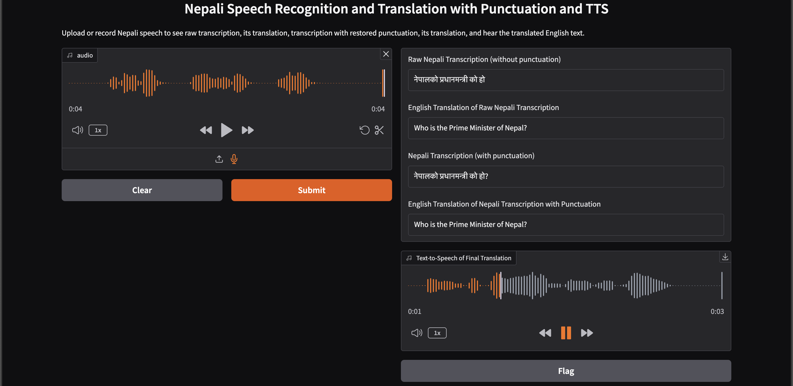

# Nepali Automatic Speech Recognition and Translation
This repository provides an end-to-end pipeline for **Nepali speech-recognition and translation to English**.

The base models used were:
- For ASR: **[Facebook's Wav2Vec2-XLS-R-300M](https://huggingface.co/facebook/wav2vec2-xls-r-300m)**
- For Translation: **[Helsinki NLP opus-mt mul-en](https://huggingface.co/Helsinki-NLP/opus-mt-mul-en)**
- For Punctuation Restoration: **[Google's mt5-small](https://huggingface.co/google/mt5-small)**

The trained models can be found here:

- 🗣️ **[Wav2Vec2_XLS-R-300m_Nepali_ASR](https://huggingface.co/iamTangsang/Wav2Vec2_XLS-R-300m_Nepali_ASR)** for **Nepali Automatic Speech Recognition (ASR)**
- 🌐 **[Nepali-English-Translation-MarianMT](https://huggingface.co/iamTangsang/Final-Model-Ne-En)** for **Neural Machine Translation (NMT)** from **Nepali to English**
- 🔄 **[Nepali Text Punctuation Restoraion Model](https://huggingface.co/iamTangsang/nepali-punctuation-restoration-mt5-final)**

The project includes training and inference notebooks for ASR, punctuation restoration and NMT components, fine-tuned on publicly available Nepali datasets.

## 🗂️ Datasets Used
### For Nepali ASR
- [CommonVoice v17](https://huggingface.co/datasets/mozilla-foundation/common_voice_17_0)
- [OpenSLR54 - Large Nepali ASR training data set](https://www.openslr.org/54/)
  - The filtered and preprocessed version can be found [here.](https://huggingface.co/datasets/iamTangsang/OpenSLR54-Nepali-ASR)

### For Translation
#### Pretraining data sets:
- [Filtered NLLB Corpus](https://huggingface.co/datasets/iamTangsang/Nepali-to-English-Translation-Dataset)
- [OpenWiseyak-0.1-pretraining data](https://huggingface.co/datasets/Wiseyak/OpenWiseyak-0.1-Pretraining)
- [Synthetic Nepali-English sentence pairs](https://huggingface.co/datasets/sharad461/ne-en-synthetic-1.6m)
#### Finetuning data sets:
- [Parallel 208k Nepali-English](https://huggingface.co/datasets/sharad461/ne-en-parallel-208k)
- [Subset of the data sets found here](https://github.com/BISHALTWR/Nepali-English-Translation-Dataset)

### For Punctuation restoration
- [This](https://huggingface.co/datasets/sharad461/ne-en-parallel-208k) dataset was modified. All the english sentences were removed. All the spaces and punctuations were removed from the nepali texts and were treated as input to the mT5-small model. The target was the original Nepali sentences.

## 📓 Colab Notebooks

### Nepali ASR
- [This](./notebooks/ASR-Notebooks/FineTuning-XLSR-300-m-on-Common-Voice-17-0-ne-NP.ipynb) notebook was used to fine-tune wav2vec2 on common voice 17.
- [This](./notebooks/ASR-Notebooks/XLS_R_300_OpenSLR.ipynb) notebook was used to fine-tune on OpenSLR-54.
- [This](./notebooks/ASR-Notebooks/New_Learning_Rate_XLS_R_300_OpenSLR.ipynb) notebook was used for final-fine tuning with new vocabulary definition and new learning rate.

### Nepali-English Translation
- [This](./notebooks/Translation-Notebooks/Dataset-Creation-New.ipynb) was used for preprocessing of NLLB dataset.
- [This](./notebooks/Translation-Notebooks/PreTraining-Final-MarianMT.ipynb) was used to pretrain as well as finetune the final models.
- [This](./notebooks/Translation-Notebooks/Visualizations.ipynb) was used to evaluate the final models on chrF++ and BLEU scores on different benchmark datasets (FLORES-101, FLORES200, Tatoeba)

### Punctuation Restoration
- [This](./notebooks/Punctuation-Notebooks/Punctuation.ipynb) was used to train the punctuation restoration model.

### Final DEMO
- A GradIO interface has been implemented to showcase the final models.
- The notebook can be found [here.](./notebooks/Final-DEMO/Major_Project_Demo.ipynb)

## 📝Training Logs
- All the training was monitored using Tensorboard.
- So, if you want to see the logs, you can do it through Tensorboard.
- The log files can be found in [this](./training-logs/) directory.
  - [ASR training/fine-tuning Logs](./training-logs/ASR_Logs/)
    - [CommonVoice Logs](./training-logs/ASR_Logs/logs_commonvoice/)
    - [OpenSLR Initial Logs](./training-logs/ASR_Logs/logs_openslr/)
    - [OpenSLR Final Tuning Logs](./training-logs/ASR_Logs/logs_openslr_new/)
  - [Translation training/fine-tuning Logs](./training-logs/Translation_Logs/)
    - [Training logs on filtered NLLB Corpus](./training-logs/Translation_Logs/nllb-synthetic-preTrain-logs/)
    - [Training logs on ](./training-logs/Translation_Logs/synthetic-preTrain-logs/)
    - Final fine-tuning logs [this](./training-logs/Translation_Logs/208k-fine-tune-logs/) and [this.](./training-logs/Translation_Logs/Final-Model-Ne-En-Logs/)
  - [Punctuation Restoration Logs](./training-logs/Punctuation_Logs/logs/)

## 📊Results
### ASR Evaluation results:
| Model                  | Dataset    | Method                     | CER    | WER     |
|------------------------|------------|-----------------------------|--------|---------|
| wav2vec2 XLS-R 300M    | OpenSLR54  | Self-supervised Transformer | 2.72%  | 16.82%  |

### Translation Evaluation results: 
| Model                    | Dataset                | BLEU   | ChrF  |
|--------------------------|------------------------|--------|-------|
| Our MarianMT (Validation) | Internal Validation     | 35.34  | -     |
| Our MarianMT (Test)       | Internal Test           | 33.12  | -     |
| Our MarianMT              | FLORES (dev)            | 27.14  | 57.24 |
| Our MarianMT              | FLORES (devtest)        | 28.32  | 57.44 |
| Our MarianMT              | Tatoeba                 | 39.33  | 55.07 |

## 📸 Demo Screenshot

## 💻 Usage
- The models have been published in HuggingFace.
- So, you can directly use the model from there.
- A simpel GradIO interface implementing the whole end-to-end Nepali-to-English translation pipeline is [here.](./notebooks/Final-DEMO/Major_Project_Demo.ipynb)
- Download the notebook and run it.
## 📄 License
This project is released under the **MIT License**.

#### Built with ❤️ in IOE, Pulchowk Campus. TU. Nepal. 

